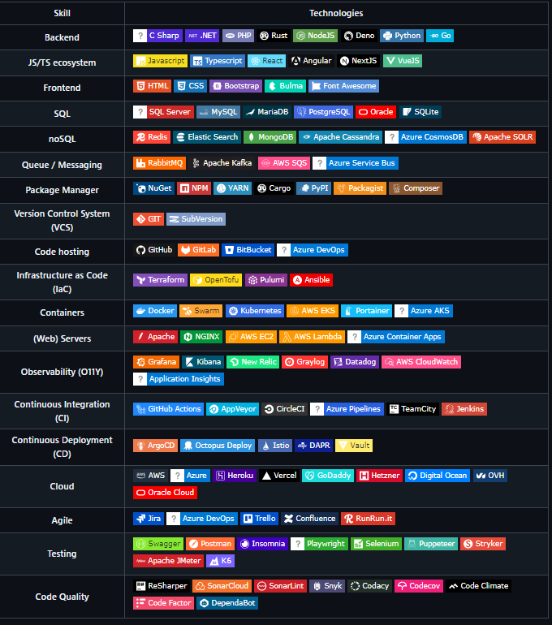

# GitHub Badges Action

[](https://github.com/guibranco/github-badges-action)
[](https://github.com/guibranco/github-badges-action)
[](https://github.com/guibranco/github-badges-action)
[](https://github.com/guibranco/github-badges-action)

[](https://github.com/super-linter/super-linter)

[](https://github.com/guibranco/github-badges-action/actions/workflows/check-dist.yml)
[](https://github.com/guibranco/github-badges-action/actions/workflows/codeql-analysis.yml)
[](https://wakatime.com/badge/github/guibranco/github-badges-action)
[](./badges/coverage.svg)

📄 :octocat: GitHub Action to update readme with badges (using
[ShieldsIo](https://shields.io) and [SimpleIcons](https://simpleicons.org/) for
icons).

Set skills with categories in a `.json` file in your repository, and then run
this action to create a [Shields.io](https://shields.io/) badge with
[SimpleIcons](https://simpleicons.org/) labels.

Input: `{ "slug": "github" }`

Output:


## Usage

- `input` (optional). The source file for the skills. **Default:**
  `.github/automations/badges.json`.
- `output` (optional). The destination file for the replacement. **Default:**
  `README.md`.
- `create-pr` (optional). Optionally creates a pull request instead of direct
  commit and push. **Default:** `false`.
- `branch` (optional). Optionally, find `input` and `output` files from a
  specific branch. **Default:** `main` (the repository default branch).
- `section-name` (optional). Optionally set the section name for replacement in
  the `output` file. **Default:** `skills-badges`. This is useful when multiple
  sections are in the same file for different results.

## Outputs

None.

## Example

```yml
name: 'Update skills badges'

on:
  schedule:
    - cron: '0 0 1 * *' # runs every first day of each month, at 00h00.
  workflow_dispatch: # runs via workflow dispatch (manually).

  jobs:
    update-badges:
      runs-on: ubuntu-latest
      permissions:
        contents: write
        pull-requests: write

      steps:
        - uses: actions/checkout@v4

        - name: Run the action
          uses: guibranco/github-badges-action@latest
```

## Sample result


## Pixeebot Activity Dashboard


This dashboard summarizes my activity on the repository, including available improvement opportunities.
